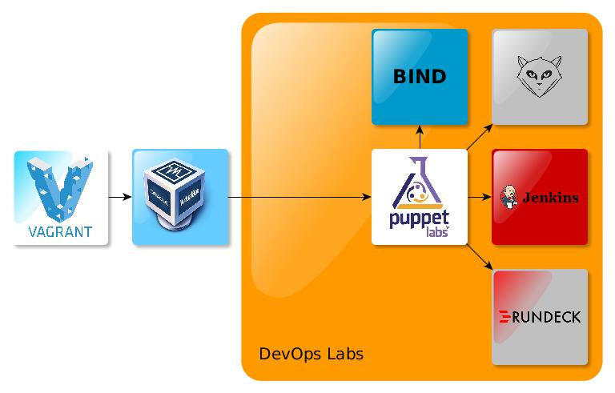
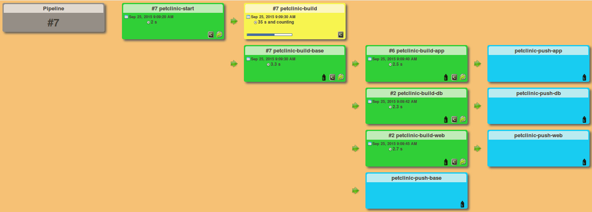

# Get your lab!
Many companies want a lab, a kind of research workspace. And so do some people. That's a good way to understand, learn, and improve some tools, let me say devops tools. And in order to setup a such lab, I propose this project G10B (numeronym for __Get your lab!__).

In my opinion a such lab should be an Infra-as-code Lab. So I decide to code my own lab. The goal of this project is to launch an installer and wait and see for the result. The side effect is that I can install it again and again, I can test improvements easily without fearing a crash. And in fact if I crash my lab I just have to reinstall my master branch. 

As a starter, Vagrant provisions the VMs and bootstraps a basic installation (puppet master or puppet agent). Puppet master installs itself and with the recurring appliance (*puppet agent --test*) installs the others servers.

Anyway, currently the project allows you automatically to:
* Vagrant pops the VMs with Puppet agents
* Bootstap installation of Puppet master
* Puppet-master configures itself
* Puppet configures all machines
* Feed Puppet-master with modules and manifests for g10b itself and others applications (as an example I take the famous petclinic)

Then Jenkins, GitLab, Rundeck, Mesos, Docker, Elasticsearch, Logstash, Kibana and Puppet are ready!

## Prerequisites
To use this tools, you need a hosting plateform with:
* git
* Vagrant 
* VirtualBox

## Installation
On your host (for example your laptop with virtualBox), follow the step by step commands below:

    env GIT_SSL_NO_VERIFY=true git clone https://github.com/oloc/g10b.git 
    ./g10b/start

This command will pop the needed VMs in virtualbox and install the stuff.
If you possess a datacenter or a cloud and if you want to test the installation you have to launch the *install* scripts in the appropriate machines.

## Usage
You can access to the Jenkins, Gitlab, Rundeck, Mesos and Kibana in your browser at:
* http://\<module name\>.\<domain\> 
* http://g10b.oloc (by default)

## Configuration
The infrastructure is described in the __hieradata/provision.json__ file. 
The applications are described in the __app__ directory.
The configuration of the servers is described in the puppet manifests and modules of the application g10b.

If you modify the project settings, you have to add the DNS VM (g10b-gateway) as a resolver of your host (for example your laptop with virtualBox), regarding the IP addresses you configure in the *Vagrantfile* and in the *provision.json* (as the iplastdigit parameter). As default, the *start* initiate for you this command:

    echo 'nameserver 192.168.10.50' | sudo resolvconf -a *

## Applications description
All the applications of your lab can be described in the __app__ directory following some rules.
* One directory per application, named with the name of the application
* Application directory contains the 3 directories below:
  * modules
  * manifests
  * hieradata
* Application directory contains the file with the needed puppet module: __modules.lst__

## Versions
* V0.8 - Add petclinic as an exemple in the Jenkins. Technical improvement: Application notion. g10b is considered as an application.
* V0.7 - Add Docker and Docker Registry. Technical improvements: Hiera variables revision.
* V0.6 - Add ELK (ElasticSearch Logstash Kibana)
* V0.5 - Technical version: Remove Import nodes. Add Environment directory to be Puppet-4-ready. Add Travis rake test.
* V0.4 - Vagrant uses own boxes. Infrastructure is revised. Gateway and DNS are activated. Mesos is available.
* V0.3 - Add Rundeck Jenkins and Gitlab
* V0.2 - Vagrant pops the infra, and bootstap the installation of Puppet-master. Puppet-master feeds and configures itself.
* V0.1 - script of installation of puppet-master on a system. It's more than a bootstrap. It's a bootstrap installing puppet-master and a feeder of modules and manifests needed to configure puppet itself by itself.

## My own configuration
I do not possess a datacenter or a cloud, so I proceed with VMs. To help you if you are in troubles, here is my own configuration:

* Operating System: Ubuntu 14.04.1 LTS, Trusty Tahr
* Kernel: 3.13.0-62-generic
* MoBo: W54_55SU1,SUW
* CPU: Intel(R) Core(TM) i7-4712MQ CPU @ 2.30GHz
* Memory: 2x 8GiB SODIMM DDR3 Synchrone 1600 MHz (0,6 ns)
* VirtualBox 4.3.10 r93012
